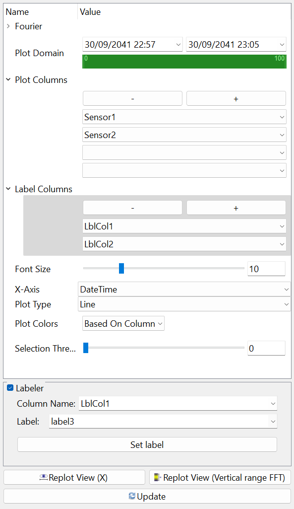
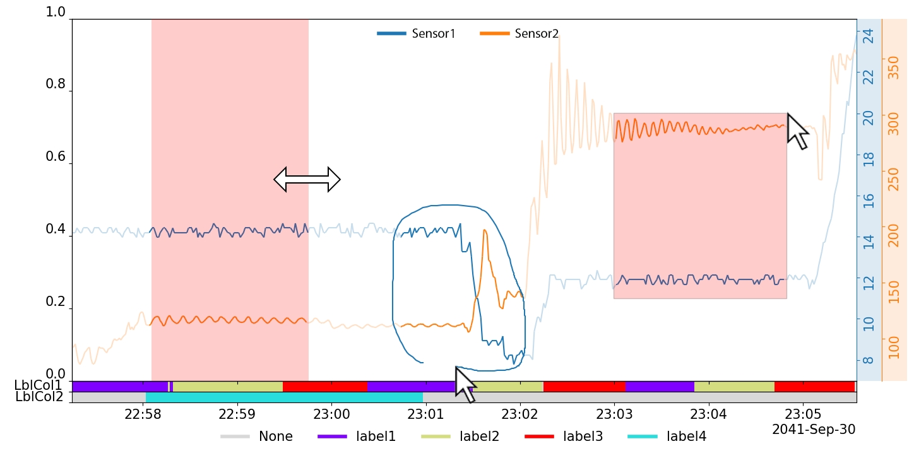
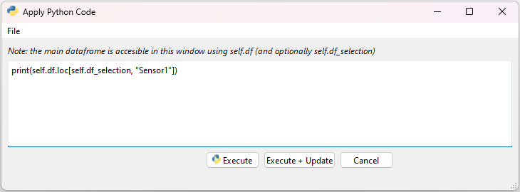

<!-- # MVTS-Analyzer -->
<p align="center">
	<!--  -->
	<!--  -->
	
</p>

MVTS-Analyzer is an open-source Python app/package for plotting, analyzing and annotating multivariate time series. The app was mainly implemented using [PySide6](https://pypi.org/project/PySide6/), [Pandas](https://pypi.org/project/pandas/) and [Matplotlib](https://pypi.org/project/matplotlib/) and makes it easy to quickly load, display and manipulate multivariate time-series data from a .CSV, .XLSX or pandas-dataframe-pickle file.

- [Features](#features)
	- [Display-control](#display-control)
	- [Datapoint Selection](#datapoint-selection)
	- [Multiple Views](#multiple-views)
	- [Python Code](#python-code)
	- [Supported formats](#supported-formats)
	- [And more!](#and-more)
- [Installation](#installation)
	- [GitHub](#github)
	- [PyPi](#pypi)
- [Running](#running)

# Features

## Display-control

We can select what columns/sensors to display using the plot-settings, each sensor gets its own axis on which the data is plotted. All data is normalized to the view to enable visualization of data with widely different scales. Individual axes can be controlled (pan/zoom) by dragging the axis using left- or right mouse button. We can plot label-columns (```pandas-category```/```integer```/```string```) underneath the main-plot to show how the data is annotated (multiple supported).
<p align="center">

</p>

What data to plot is also controlled using the side-window with the plot-settings. 
<p align="center">

</p>

## Datapoint Selection

We can use domain, lasso- and rectangle-selection methods to select and annotate data - and select new datapoints either complementary, subtractively or additively. Selected datapoints are highlighted in the plot and can be hidden/shown and annotated.
<p align="center">
	
</p>

## Multiple Views

We can open multiple views and plot the same data in different ways using line- and scatter-plots. Point-selection is shared between views, so we can plot different sensors against each other, and select point in one view to highlight them in the other views. This is useful for example to quickly identify and annotate outliers in the data - or to select certain patterns in the data.
<p align="center">

</p>

## Python Code
We can run python-scripts to manipulate the loaded Dataframe using the built-in python-console. This allows us to quickly manipulate the (selected) data and plot the results. Python-scripts can be saved and loaded, allowing us to quickly apply the same manipulations to different datasets.

Several example-scripts (e.g. data normalization) are included and can be found under the "Apply"-tab in the main-window. 

<p align="center">

</p>


## Supported formats

MVTS-Analyzer supports ```CSV```, ```XLSX``` and ```Pandas-dataframe-pickle``` files. The app will automatically detect the file-format and load the data accordingly.
The only requirement for the data is that it contains a ```DateTime``` column, formatted as ```YYYY-MM-DD HH:MM:SS``` or ```YYYY-MM-DD HH:MM:SS.ffffff```. The app will automatically detect the column containing the DateTime data.

## And more!

Other features include:

- Renaming and deleting columns
- Renaming and deleting annotations
- Copying the currently displayed figure
- Exporting the currently displayed figure 
- Displaying fft-plots behind the main-plot, pandas columns with numpy arrays are automatically detected


# Installation

## GitHub

Clone the repository and install the requirements (e.g. using pip):
```bash
git clone https://github.com/Woutah/MVTS-Analyzer.git
cd MVTS-Analyzer
pip install -r requirements.txt
```

## PyPi

MVTS-Analyzer is also available as a python-package on PyPi, and can be installed using package managers such as pip:

```bash
pip install mvts-analyzer
```

# Running

If the package was installed using pip, the app can be started using the ```mvts-analyzer``` command:

```bash
mvts-analyzer <options>
```

Or the short-hand version:

```bash
mvtsa <options>
```

To check if everything is working, we can pass the ``--example`` option to launch the app and load the example data:

```bash
mvtsa --example
```

If the package was cloned from GitHub, the app can instead be started by running the ```main.py``` file:

```bash
python main.py <options>
```

We can use the ```--help``` option to see what options are available:

<!-- Table: -->
| Option | Argument(s) | Description |
| --- | --- | --- |
| ```-h``` or ```--help``` | - |Show help message and exit |
| ```-e``` or ```--example``` | - | Load the example data |
| ```-f``` or ```--file``` | FILE | Path to the initial data to load (`.xlsx`, `.csv` or pickled Pandas Dataframe) |
| ```-m``` or ```--use_monitor``` | MONITOR | Integer-index on which to launch the app |
| ```-d``` or ```--dark_mode``` | - | Enables dark mode |
